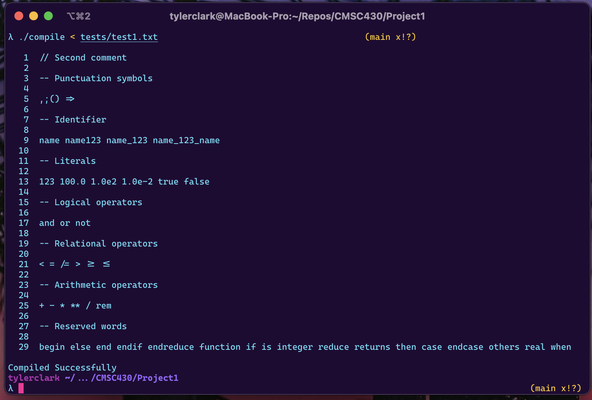
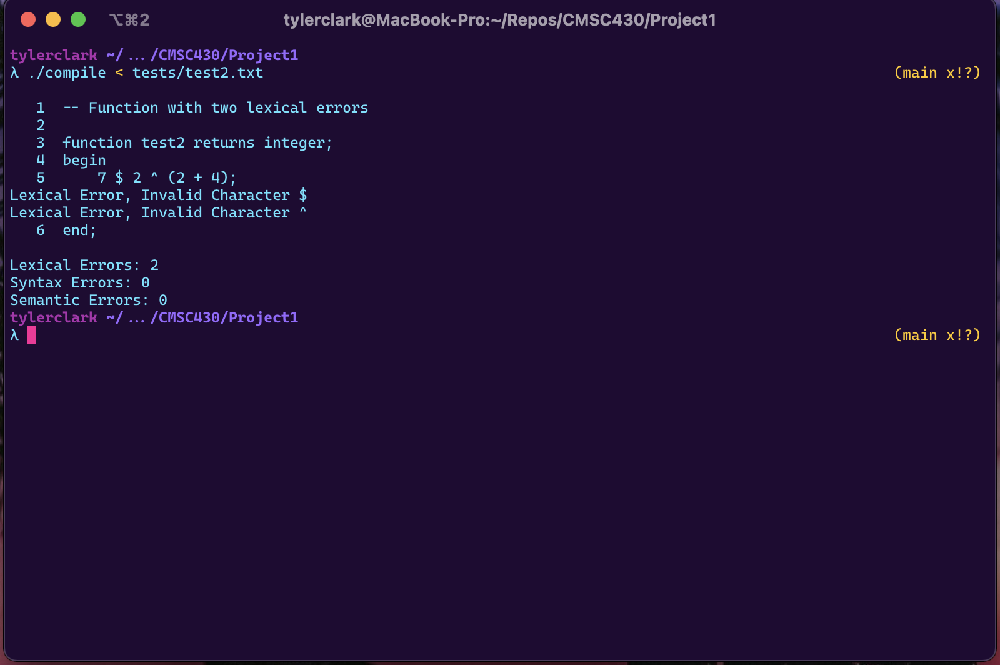
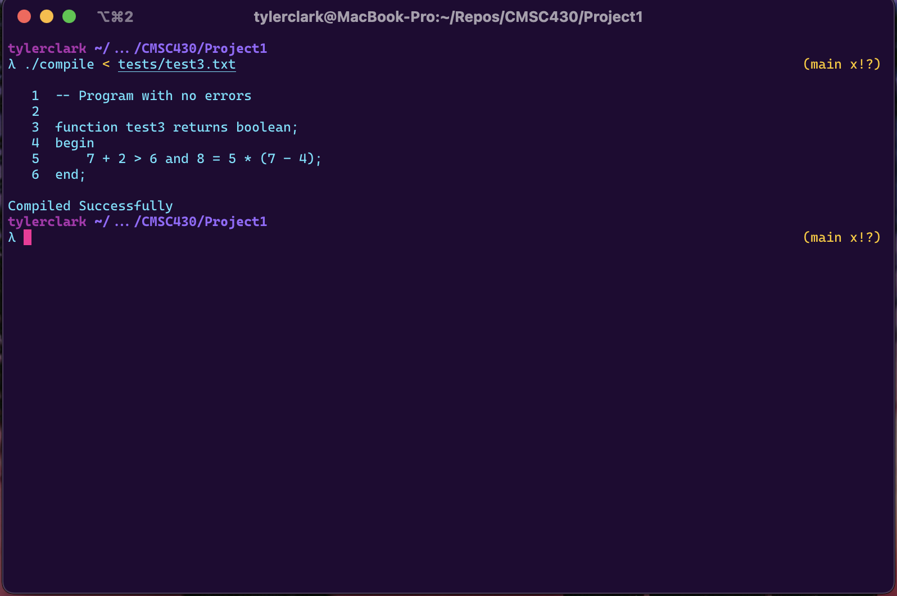

# CMSC 430 Project 1

**Author:** Tyler D Clark  
**Date:** 1 November 2021

**Description** The first project involved modifying a lexical analyzer and compilation listing generator code.
___

## Approach

In preperation for this project, I needed to understand how flex operated. I read the required material, watched the videos and got to work. With the knowledge I gained, I was able to add in the reserved words and lexemes. Everything I needed to accomplish this project was provided through the reading and videos. The only thing I needed outside of the material was a brush up on regex and a review of the flex code.

I first added in the reserved words, because it was as easy as listing the words and returned the corresponding tokens. I then added in the lexemes that required regex. This was the part that required more work as I had to look up the regex syntax. Lastly, I added in the code for the listing generator.

## Test cases

### Test 1

The first test case was to test all of the lexemes and keywords in the language. The lexical analyzer was modified to recognize all of those keywords and lexemes listed in the directions.

input: test1.txt

output:

### Test 2

The next test case was to test the lexical analyzers ability to detect and report multiple errors. This test case is borrowed from the week 2 resources.

input: test2.txt

output:

### Test 3

The last case is a program with no errors. This test case is also borrowed from the week 2 resources.

## Lessons Learned

Through this project, I gained valuable information about flex, regex, C++ and how to use them together. I also learned how to use the flex code to create a lexical analyzer. I did not experience any major hiccups, but a I did spend a lot time trying to make the regex work. This project was also a good brush up on C++ and I always enjoy using it. This is also the first time I have used make instead of CMake, so I learned as much as I could about the makefile and even included a clean command. Given the amount of time I spent on this project, I am confident that I will be able to build off of this information the future projects.
