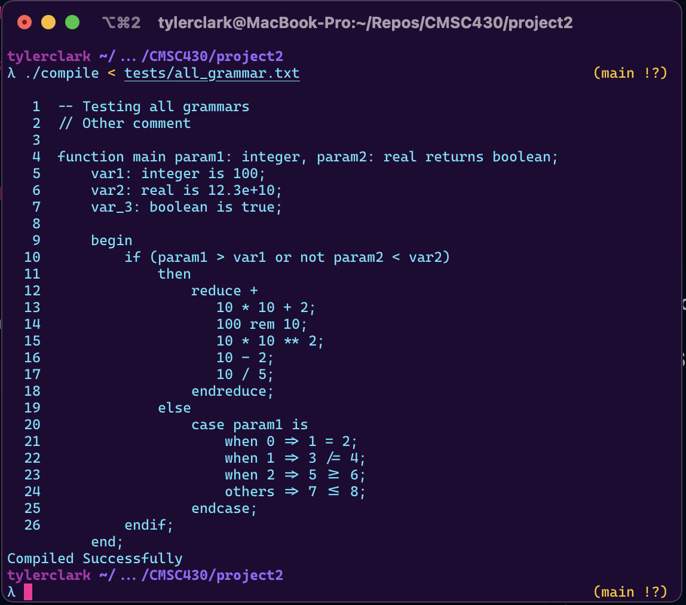
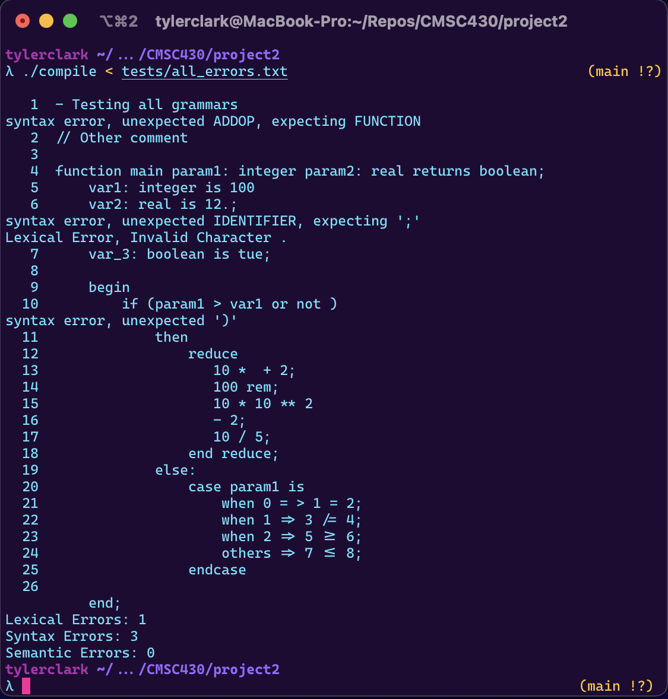
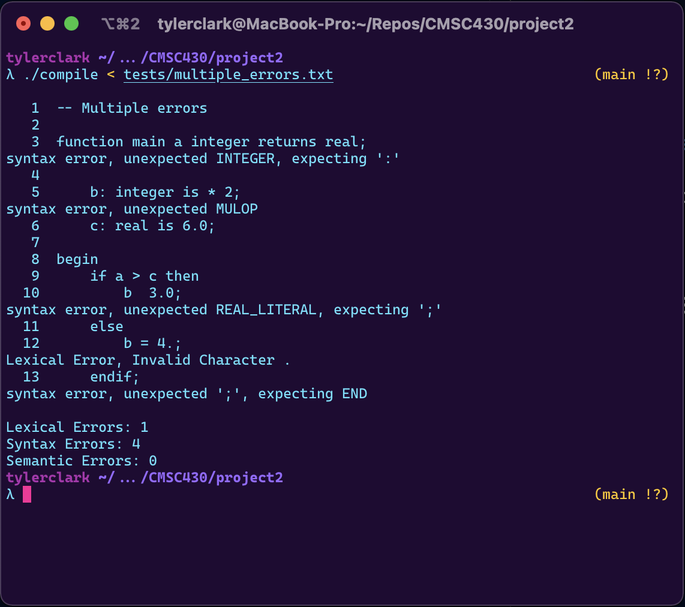

# CMSC 430 Project 2

**Author:** Tyler D Clark  
**Date:** 15 November 2021

**Description** The second project involves modifying the syntactic analyzer for the attached compiler by adding to the existing grammar.
___

## Approach

I started by reading up on the reading materials for the assignment. I watched all of the videos as well to get a good understanding before continuing. I then transferred the lexer and the generator code from the previous project to this project. This was so that I could properly view errors and the lexer could identify the correct tokens. I then modified the parser to incorporate the new grammar from this project.

## Test cases

### Test case 1

The first test case was to test all of the productions added in this assignment. I used the following code to test the grammar:

```md
-- Testing all grammars
// Other comment

function main param1: integer, param2: real returns boolean;
    var1: integer is 100;
    var2: real is 12.3e+10;
    var_3: boolean is true;

    begin
        if (param1 > var1 or not param2 < var2)
            then
                reduce +
                   10 * 10 + 2;
                   100 rem 10;
                   10 * 10 ** 2;
                   10 - 2;
                   10 / 5;
                endreduce;
            else
                case param1 is
                    when 0 => 1 = 2;
                    when 1 => 3 /= 4;
                    when 2 => 5 >= 6;
                    others => 7 <= 8;
                endcase;
        endif;
    end;
```

the following output was produced:



### Test case 2

For the next test case, I was to test all of the productions for errors. I made errors on every grammar production, but due to the premature state of our compiler, not every error was caught. I used the following code:

```md
- Testing all grammars
// Other comment

function main param1: integer param2: real returns boolean;
    var1: integer is 100
    var2: real is 12.;
    var_3: boolean is tue;

    begin
        if (param1 > var1 or not )
            then
                reduce 
                   10 *  + 2;
                   100 rem;
                   10 * 10 ** 2
                   - 2;
                   10 / 5;
                end reduce;
            else:
                case param1 is
                    when 0 = > 1 = 2;
                    when 1 => 3 /= 4;
                    when 2 => 5 >= 6;
                    others => 7 <= 8;
                endcase
        
    end;
```

The following output was produced:



### Test case 3

For the last test case, I was to test a program with multiple errors. For this test case, I borrowed the test case from Project 2 skeleton test data folder:

```md
-- Multiple errors

function main a integer returns real;

    b: integer is * 2;
    c: real is 6.0;
    
begin
    if a > c then
        b  3.0; 
    else
        b = 4.; 
    endif;
;
```

the following output was produced:


## Lessons Learned

For this project, I learned a lot about context free grammars. I learned how using recursion within a production could produce a list of items. Another thing I learned using left vs right recursion produced left and right associativity. Lastly, I learned that by breaking productions into more specific productions, I could introduce precedence. For instance, making a term production to add operations and factor production to multiply. like:

``` md
term:
 term ADDOP factor 
 | factor 
 ;
      
factor:
 factor MULOP exponent 
 | factor REMOP exponent
 | exponent
 ;
```

and in this way, the lower the rule, the higher the precedence.
