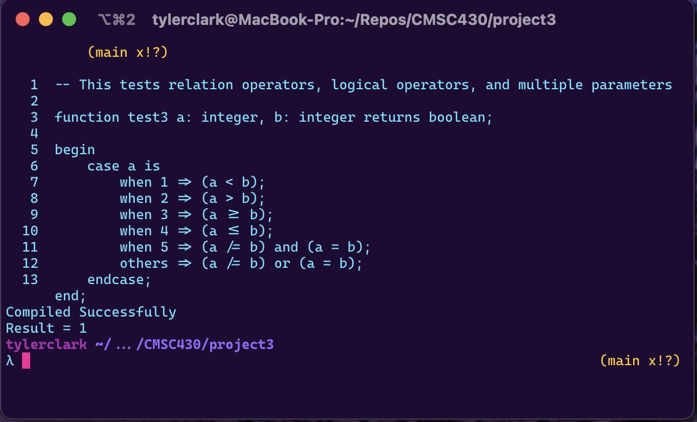

# CMSC 430 Project 3

**Author:** Tyler D Clark  
**Date:** 30 November 2021

**Description** The third project involves modifying the attached interpreter so that it interprets programs for the complete language.
___

## Approach

Like the previous projects, I started by reading up on the reading materials for the assignment. Again, I watched all the videos as well to get a good understanding before continuing. I then transferred the lexer and the generator code from the previous project to this project. This was so that I could properly view errors, the lexer could identify the correct tokens and the parser could parse the given language. The first changes I made was to fully list all the tokens to be used in
the language in values.h. I then made sure the proper token was being returned in scanner.l and in the case of operators, yylval.oper was being set. Next, I added the code to process each different type of statement and lastly added them to the correct productions in the bison file.

## Test cases

### Test case 1

The first test case was to test real values, multiple variables, arithmetic operators, and case statements. The following code was used to test the interpreter:

```md
-- Tests real evaluation, arithmetic operators, case expression evaluation, multiple variables.

function test1 a: integer returns real;
    b: real is 12.3 + 4.5;
    c: real is 6.78 - 9.10;
    d: real is 12.3 / 4.5;
begin
    case a is
        when 1 => b * 6.7;
        when 2 => c * (8.9 rem 1.0);
        others => d ** 2;
    endcase;
end;
```

the following output was produced:


### Test case 2

For the next test case, I tested boolean literals, the not operator and the if expression. I used the following code:

```md
-- Tests boolean literal evaluation, not operator, if expression.

function test2 a: real returns boolean;
    b: boolean is true;
begin
    if a > 0 then
        b;
    else
        not b;
    endif;
end;
```

The following output was produced:


### Test case 3

For the last test case, I tested relation operators, the logical operators and finally multiple parameters. I used the following code:

```md
-- This tests relation operators, logical operators, and multiple parameters

function test3 a: integer, b: integer returns boolean;

begin
    case a is
        when 1 => (a < b);
        when 2 => (a > b);
        when 3 => (a >= b);
        when 4 => (a <= b);
        when 5 => (a /= b) and (a = b);
        others => (a /= b) or (a = b);
    endcase;
end;
```

the following output was produced:




## Lessons Learned

For this project, I learned a lot about syntax directed translation. I gained valuable information on bison and flex files and took this opportunity to brush up on my C++ skills. The videos for the week allowed me to get a good understanding on how these different types of files worked together. The real challenge was understanding how and when to interpret values for different statements. I ran into major hiccups trying to figure out how to use actions within the bison code. Overall, it was a huge learning experience.
