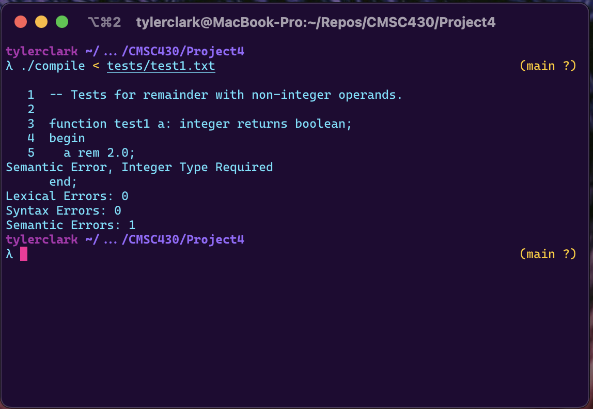
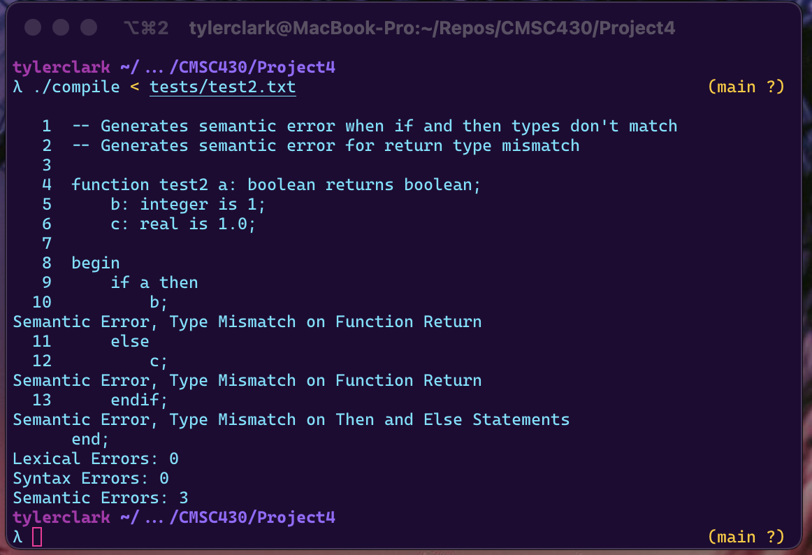
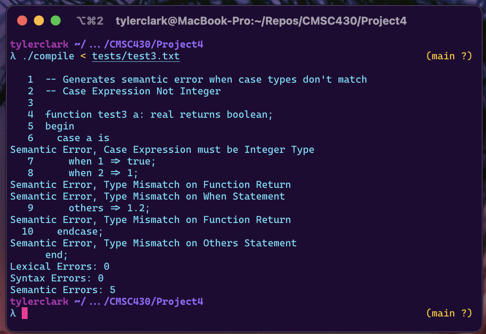
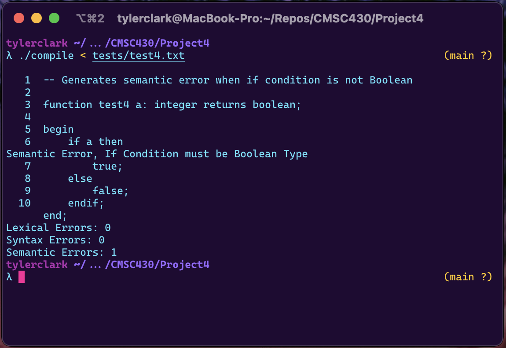
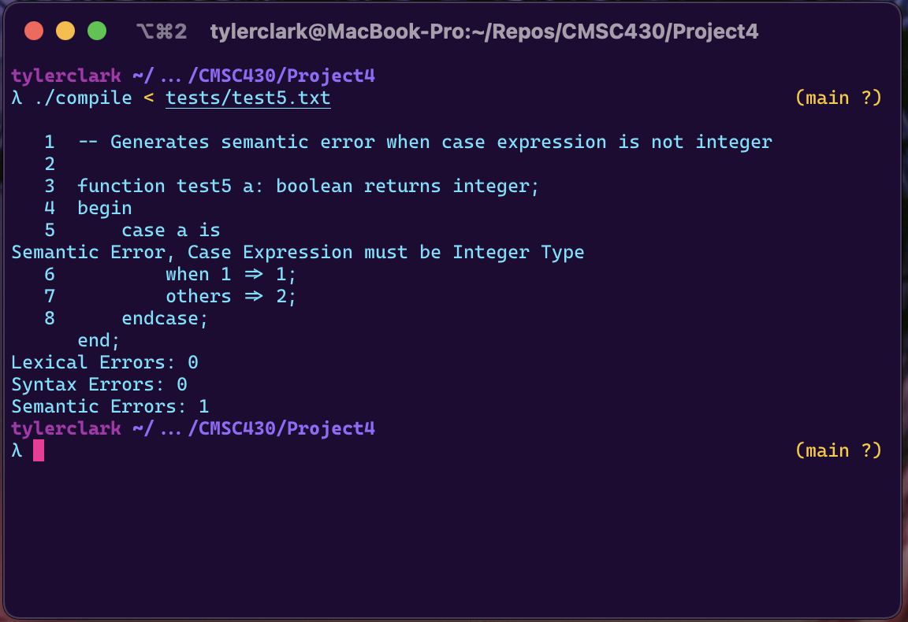
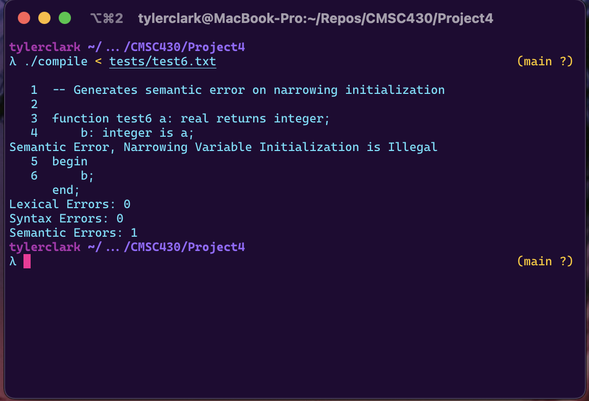
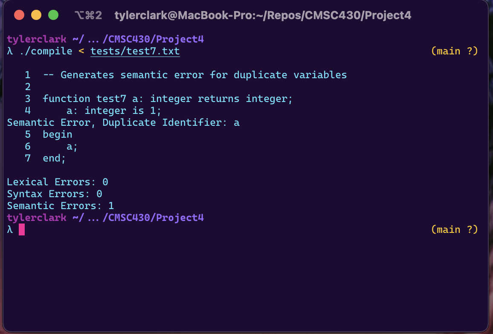
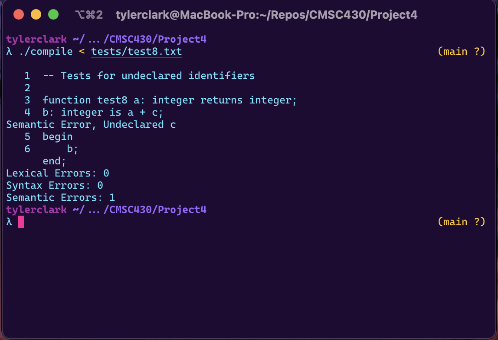
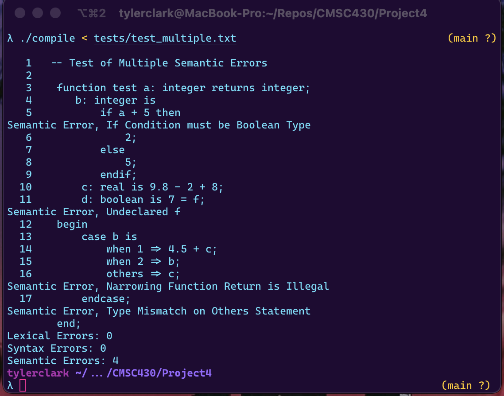

# CMSC 430 Project 4

**Author:** Tyler D Clark  
**Date:** 12 December 2021

**Description** The fourth project involves modifying the semantic analyzer for the attached compiler by adding checks for semantic errors.
___

## Approach

Like the previous projects, I started by reading up on the reading materials for the assignment. Again, I watched all the videos as well to get a good understanding before continuing. I also read up on the assignment and the project requirements. I began by transferring over code from the previous project and comparing it against the skeleton code provided for the project. I then started to modify the code to fit the project requirements and lastly wrote tests to ensure that the code was correct.

## Test cases

The test case were designed based on the assignment rubric

### Test case 1

```md
-- Tests for remainder with non-integer operands. 

function test1 a: integer returns boolean;
begin
    a rem 2.0;
end;
```

Output:


### Test case 2

```md
-- Generates semantic error when if and then types don't match
-- Generates semantic error for return type mismatch

function test2 a: boolean returns boolean;
    b: integer is 1;
    c: real is 1.0;

begin
    if a then
        b;
    else
        c;
    endif;
end;
```

Output:


### Test Case 3

```md
-- Generates semantic error when case types don't match
-- Case Expression Not Integer

function test3 a: real returns boolean;
begin
  case a is
    when 1 => true;
    when 2 => 1;
    others => 1.2;
  endcase;
end;
```

Output:


### Test Case 4

```md
-- Generates semantic error when if condition is not Boolean

function test4 a: integer returns boolean;

begin
    if a then
        true;
    else
        false;
    endif;
end;
```

Output:


### Test Case 5

```md
-- Generates semantic error when case expression is not integer

function test5 a: boolean returns integer;
begin
    case a is
        when 1 => 1;
        others => 2;
    endcase;
end;
```

Output:


### Test Case 6

```md
-- Generates semantic error on narrowing initialization

function test6 a: real returns integer;
    b: integer is a;
begin
    b;
end;
```

Output:


### Test Case 7

```md
-- Generates semantic error for duplicate variables

function test7 a: integer returns integer;
    a: integer is 1;
begin
    a;
end;
```

Output:


### Test Case 8

```md
-- Tests for undeclared identifiers

function test8 a: integer returns integer;
b: integer is a + c;
begin
    b;
end;
```

Output:


### Testing Multiple errors

```md
 -- Test of Multiple Semantic Errors    
   
  function test a: integer returns integer;    
     b: integer is    
         if a + 5 then    
             2;    
         else    
             5;    
         endif;   
      c: real is 9.8 - 2 + 8;   
      d: boolean is 7 = f;   
  begin   
      case b is   
          when 1 => 4.5 + c;   
          when 2 => b;  
          others => c;   
      endcase;   
  end;
  ```

Output:


## Lessons Learned

For this project, I had to learn to about semantic error checking and how to implement this is bison and C++ code. I did not experience any big issues with this project, but I did get good experience with C++ as well as Flex and Bison. Much of the required code was modelled off of the already provided skeleton code. For instance, checkIf() and checkRemainder() were modelled after checkAssignment() and so on. I had one small error that I stumped me for a while, but it was due to one of my design decisions early on. In listing.cc, I was tallying the semantic, syntax and lexical errors based on the ErrorCategory enums and I had not properly planned for all cases. I eventually figured out my mistake and moved on. Overall, I worked through all hardships in the project and learned a lot in the process.
